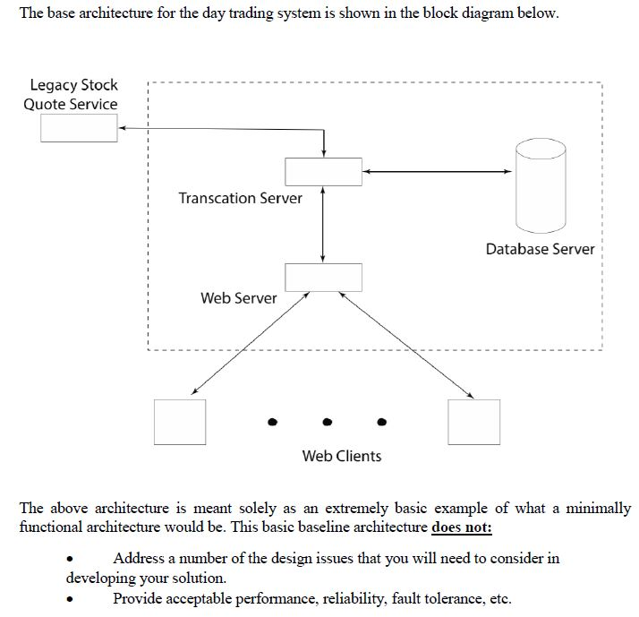

#  Project Documentation
<em> DockDockGoose - Team 4  
Milestone 1 - January 31st</em>

## 1.0 Initial Requirements
These initial requirements are derived from the specification document CourseProject.pdf.

- Develop a prototype end-to-end system to support day trading clients and services that has the capability to grow incrementally without adversely impacting transaction performance, and where such growth can be supported at minimal cost increments.
    - The basic structure of the day trading system is to support a large number of remote clients through a centralized transaction processing system.

-  The system must include a prototype mobile client application which provides a user interface to the backend day trading system as well as a local store of the current state of the given user's account information.

- The system must support the complete set of all commands that can be found in Appendix A and Commands.html. Thus enabling each client to log in through a web browser and perform serveral stock trading and account management activities such as:
    - View their account
    - Add money to their account
    - Get a stock Quote
    - Buy a number of shares in a stock
    - Sell a number of shares in a stock they own
    - Set an automated sell point for a stock
    - Review their complete list of transactions
    - Cancel a specified transaction prior to its being committed
    - Commit a transaction

- The front-end website will be used by the course tutorial instructor to test and interact with each team's operational system.

- Complete transaction logs of all client activites within the system must be able to be produced on demand.
    - These logs must contain a record of each individual transaction (including timestamps), each transactions processing time information, security related keys, and all acount state changes within the system.
    - This log must be dumped from the system as an ASCII text file via the "DUMPLOG" command.

- The prototype system must interact with the ACME StockSystems Inc. legacy quote server.
    - Caching strategies may be applied to reduce quote server access time, but all business rules and specification must still be met.
    - Each stock quote provided by the stock server incurs a charge that is passed directly onto DayTrading customers, this must be minimized.
    - Given a stock symbol and user id, this server returns the stock's current value, the user ID, and a cryptographic key. This key is required for auditing purposes and must be included in the client's transaction history as an additional field associated with the QUERY command recorded in the system transaction database.

- The technology stack used to build the system must include Docker Container technologies.

### 1.1 Architecture Goals
The developed prototype system and architecture must meet the following overall gaols:
- Minimum transaction processing times.
- Full support for required features.
- High reliability and maintainability of the system.
- High availability and fault recoverability (i.e. proper use of fault tolerance).
- Minimal costs (development, hardware, maintenance, etc.).
- Apropriate security.
- A clean web-client interface.

### 1.2 Documentation
A complete and professional set of documentation must be delivered at the end of the project in addition to the working prototype. This documentation includes:
- Full documentation of architecture including complete analysis of design choises.
- Full documentation of test plans, testing results, and test analyses.
- Full documentation of work effort required to build the prototype, including weekly individual log book entried signed by each member of the design team.
- Complete capacity planning and trasnaction time documentation, including experimental results and extrapolations.
- Full security analysis.
- Full project planning and execution documentation for prototype development effort.
- Full analysis of system capacity and capacity planning documentation.

## 2.0 Programming Tools & Libraries

The technology stack for our prototype day trading system are outlined below.

#### Web Framework
 * **DJango**
 * Flask

#### Containerization  
 * **Docker**

#### DataBase Management 
 * **PostgreSQL**
 * MongoDB
#### Languages
 * **Python**
 * Java
 * Go

#### Libraries
 * **WSGI**

## 3.0 Development Platform

## 4.0 Architecture 

### 4.1 Database Schema

### 4.2 UML Diagram

## 5.0 Project Plan

## 6.0 Tasks & Responsibilities
### 6.1 Initial Cycle
- [x] Frontend setup (Django) -- Daniel
- [ ] Backend setup (wsgi/apache?) -- Dianna
- [x] Workgenerator -- Dianna  
- [ ] Server -- Damon/Daniel
- [ ] Data Base Querying.  -- Daniel
- [ ] Database Schema  - Sam
- [ ] Documentation - Team

### 6.2 Deadlines
- [x] First log books - January 17th
- [ ] Documentation - January 31st
- [ ] Verified execution of 1 user workload file - February 7th
- [ ] Verified execution of 10 user workload file - February 14th
- [ ] Verified execution of 45 user workload file - February 21st
- [ ] Verified execution of 100 user workload file - February 28th
- [ ] Verified execution of 1000 user workload file - March 14th
- [ ] Verefied execution of final 2019 workload file - March 27th
- [ ] Web interface demonstration - April 2nd
- [ ] Project presentations - April 3rd
- [ ] Final project reports submission (printed & PDF + code) - April 5th

### Presentation Slides

<em>For our 5 minute presentation of the above, our slides can be found [here]().</em>

### Criteria: 
<em>Documentation: You need to submit your doucments by du date which is going include:
- Initial Requirements
- Programming tools and libraries
- Development Platform
- Architecture (schema and UML)
- Project Plan
- Who is responsible for which part

Also a 6 page presentation slide including all above, each team is going to present their slides to all lab by sharing screen in about 5 min.
</em>